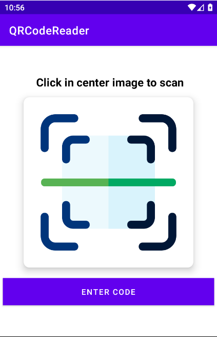
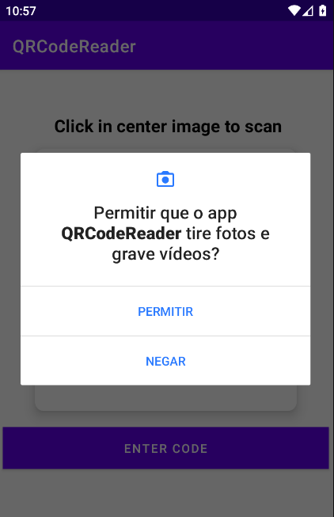
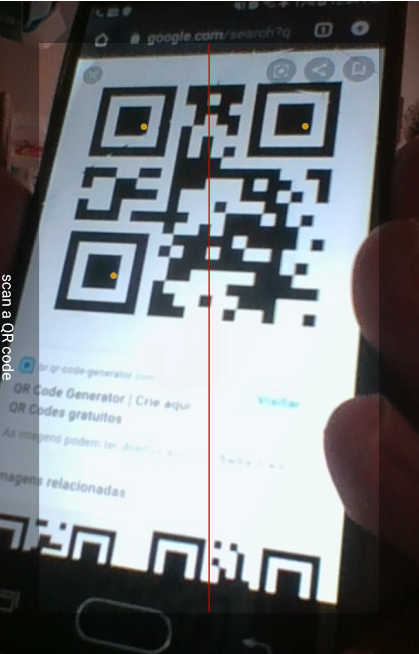
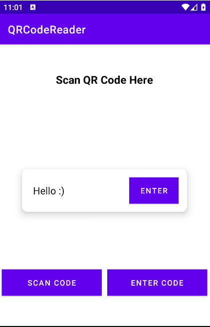

# QRCodeReader
QR Code, aplicação Android, leitor de QR Code. 
Tecnologias:
<ul>
  <li>Android Studio</li>
  <li>Kotlin</li>
  <li>ZXing Android Embedded </li>
</ul>

 

Screenshots:

 

<figure>
	
	<figcaption>Tela principal </figcaption>
</figure>

 

 

<figure>
	
	<figcaption>Permissões em tempo de execução </figcaption>
</figure>

 

 

<figure>
	
	<figcaption>Tela de captura do QRCode </figcaption>
</figure>

 

 

<figure>
	
	<figcaption>Tela exibir informação obtida </figcaption>
</figure>
  
